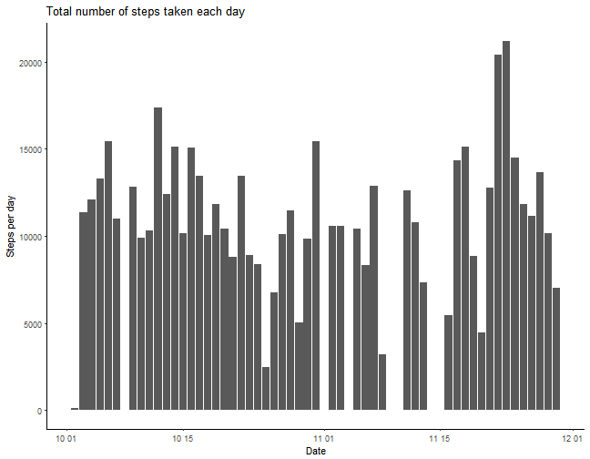
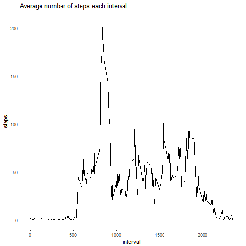
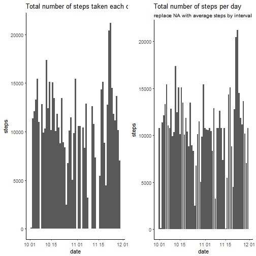

Reproducible Research: Peer Assessment 1
========================================

##Loading and preprocessing the data
First, you have to set working directory where downloaded file is located.  
Loading and prepocessing is the next step.

1. Load the "activity" data.

```r
#I named the data, ActData
ActData <- read.csv("activity.csv", sep = ",")
```
let's see how the data looks like.

```r
str(ActData)
```

```
## 'data.frame':	17568 obs. of  3 variables:
##  $ steps   : int  NA NA NA NA NA NA NA NA NA NA ...
##  $ date    : Factor w/ 61 levels "2012-10-01","2012-10-02",..: 1 1 1 1 1 1 1 1 1 1 ...
##  $ interval: int  0 5 10 15 20 25 30 35 40 45 ...
```

2. Process the data into a format suitable for your analysis
I Want to change class of "date" variable into date class

```r
ActData$date <- as.Date(ActData$date, format = "%Y-%m-%d")
```
##What is mean total number of steps taken per day?
1. Calculate the total number of steps taken per day
I know the perfect function for this step.

```r
TotalstepsPerDay <- aggregate(steps ~ date, data = ActData, sum, na.rm = TRUE)
head(TotalstepsPerDay)
```

```
##         date steps
## 1 2012-10-02   126
## 2 2012-10-03 11352
## 3 2012-10-04 12116
## 4 2012-10-05 13294
## 5 2012-10-06 15420
## 6 2012-10-07 11015
```
2. Make a histogram of the total number of steps taken each day


```r
#Use ggplot2 package
library(ggplot2)
g <- ggplot(TotalstepsPerDay, aes(date, steps))
g + geom_histogram(stat = "identity") + labs(x = "Date", y = "Steps per day") + ggtitle("Total number of steps taken each day") + theme_classic()
```

```
## Warning: Ignoring unknown parameters: binwidth, bins, pad
```



3. Calculate and report the mean and median of the total number of steps taken per day

```r
#calculate mean
MeanStepsPerDay <- mean(TotalstepsPerDay$steps)
MeanStepsPerDay
```

```
## [1] 10766.19
```


```r
#calculate median
MedianStepsPerDay <- median(TotalstepsPerDay$steps)
MedianStepsPerDay
```

```
## [1] 10765
```

##What is the average daily activity pattern?
Use aggregate function similarly, but by interval

```r
TotalstepsPerInterval <- aggregate(steps ~ interval, data = ActData, mean, na.rm = TRUE)
```
Make plot


```r
g <- ggplot(TotalstepsPerInterval, aes(interval, steps))
g + geom_line() + theme_classic() + ggtitle("Average number of steps each interval")
```




Find interval which has maximum number of steps

```r
RowNumber <- which(TotalstepsPerInterval$steps == max(TotalstepsPerInterval$steps))
MaxInterVal <- TotalstepsPerDay[RowNumber,1]
MaxInterVal
```

```
## [1] NA
```

It means someone stepped averagely most in 8:35~8:40.

##Imputing missing values

1. Calculate and report the total number of missing values in the dataset

```r
sum(is.na(ActData$steps))
```

```
## [1] 2304
```

2. Devise a strategy for filling in all of the missing values in the dataset.
I will replace NA with average number of steps per day. I already have dataframe "MeanStepsPerDay".  

3. Create a new dataset that is equal to the original dataset but with the missing data filled in.  
I will replace NA value with the mean for 5-minute interval.


```r
TestInterval <- unique(ActData$interval)
ActData_noNA <- ActData
for (i in 1:length(TestInterval)) {
  ActData_noNA$steps[is.na(ActData$steps) & ActData$interval == TestInterval[i]] <- TotalstepsPerInterval[i,2]
}
```

4. Make a histogram of the total number of steps taken each day and Calculate and report the mean and median total number of steps taken per day.
To make plot, you have to install "gridExtra" package.


```r
TotalstepsPerDay_noNA <- aggregate(steps ~ date, ActData_noNA, sum)
library(gridExtra)
g <- ggplot(TotalstepsPerDay_noNA, aes(date, steps))
plot1 <- g + geom_histogram(data = TotalstepsPerDay, stat = "identity") + ggtitle("Total number of steps taken each day") + theme_classic()
```

```
## Warning: Ignoring unknown parameters: binwidth, bins, pad
```

```r
plot2 <- g + geom_histogram(stat = "identity") + theme_classic() + ggtitle("Total number of steps per day", subtitle ="replace NA with average steps by interval")
```

```
## Warning: Ignoring unknown parameters: binwidth, bins, pad
```

```r
grid.arrange(plot1,plot2, ncol = 2)
```



Here's mean and median of total number of steps taken per day.
mean

```r
mean(TotalstepsPerDay_noNA$steps)
```

```
## [1] 10766.19
```
median

```r
median(TotalstepsPerDay_noNA$steps)
```

```
## [1] 10766.19
```

##Are there differences in activity patterns between weekdays and weekends?  
1. Create a new factor variable in the dataset with two levels - "weekday" and "weekend" indicating whether a given date is a weekday or weekend day.

```r
ActData_noNA$sorting <- "weekday"
#My laptop language is korean, so weekday default result is also korean.
ActData_noNA$sorting[weekdays(ActData_noNA$date) == c("<U+653C><U+3E64>܆<U+653C><U+3E63>öî<U+653C><U+3E63>ùº","<U+653C><U+3E63>ùº<U+653C><U+3E63>öî<U+653C><U+3E63>ùº")] <- "weekend"
ActData_noNA$sorting <- as.factor(ActData_noNA$sorting)
```

```
## Error: invalid multibyte character in parser at line 3
```

2. Make a panel plot containing a time series plot of the 5-minute interval and the average number of steps taken, averaged across all weekday days or weekend days

Construct Data aggregated by interval and sorting

```r
PlotData <- aggregate(steps ~ interval + sorting, data = ActData_noNA, mean)
```

```
## Error in eval(predvars, data, env): object 'sorting' not found
```

Make Plot!


```r
library(ggplot2)
g1 <- ggplot(PlotData, aes(interval, steps))
```

```
## Error in ggplot(PlotData, aes(interval, steps)): object 'PlotData' not found
```

```r
g1 + geom_line(col = "blue") + facet_grid(.~sorting) + theme_classic() + ggtitle("Average number of steps per interval", subtitle = "Compare between weekday and weekend")
```

```
## Error in eval(expr, envir, enclos): object 'g1' not found
```
